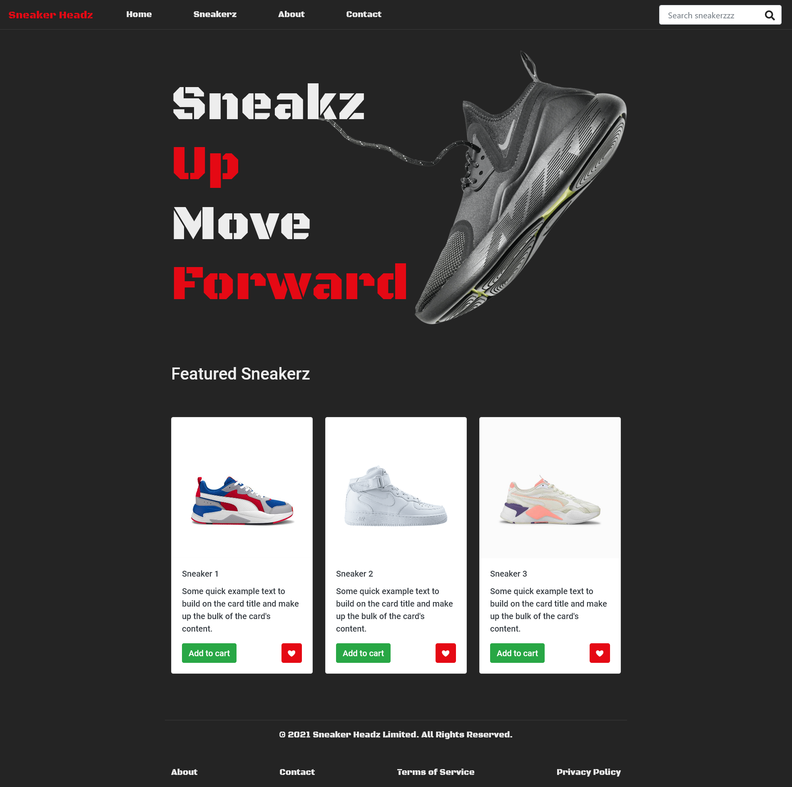
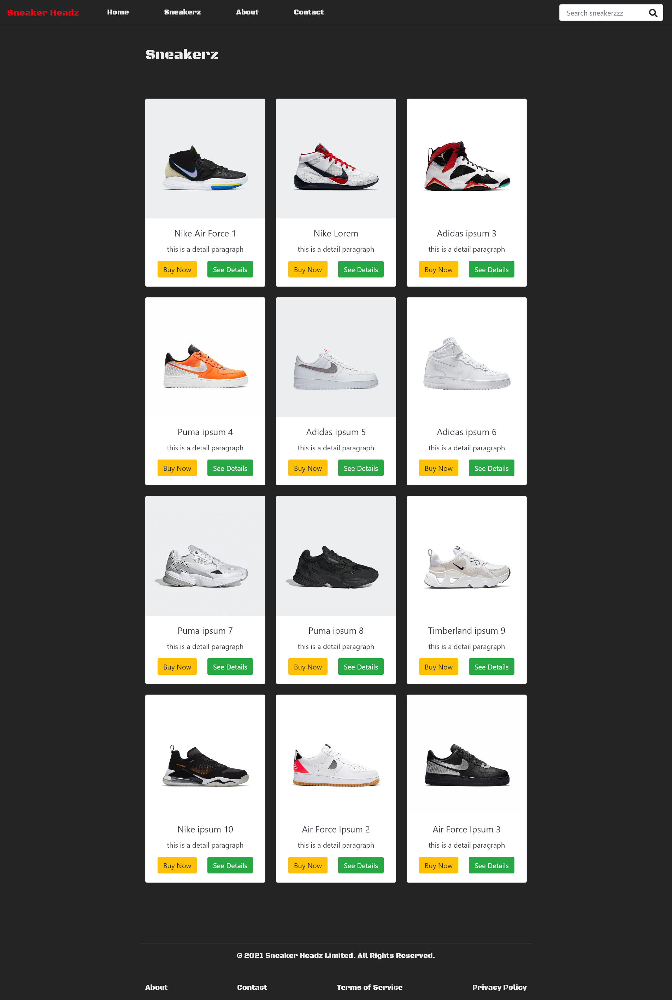
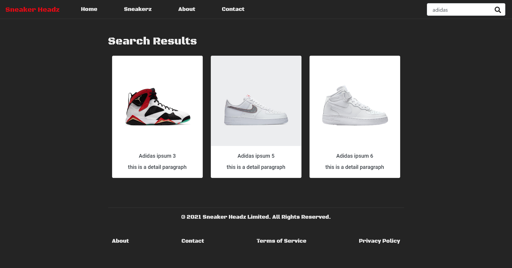
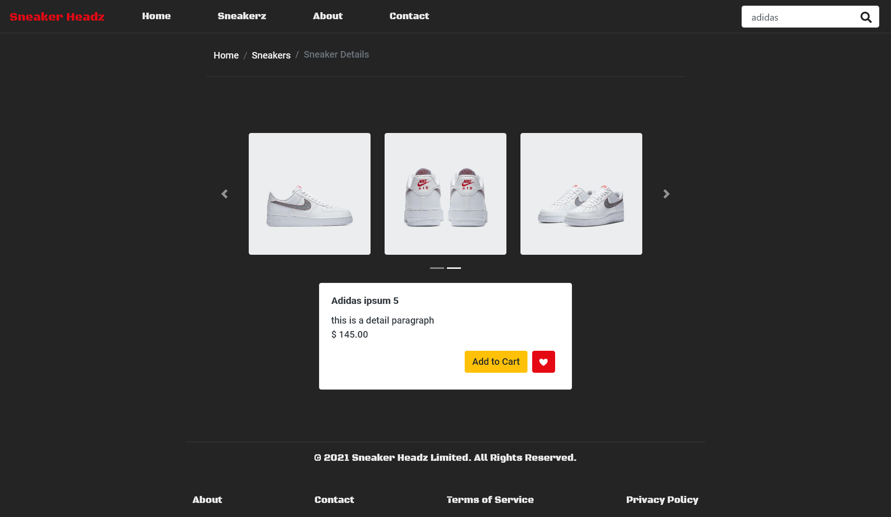

# Project: Sneaker Headz 

- SneakerHeadz is an imaginary sneaker shop demo.
- Main goal is to practice and implement React Router.

### Task List

### Stage I
- [x] Find background and product images.
- [x] Process background images with Photoshop.

### Stage II
- [x] Create React environment in local.
- [x] Install React Router & React Bootstrap.
- [x] Create component files and folders according to the UX.
- [x] Code basic outlines of project.
- [x] Homepage.
- [x] Product page.
- [x] Contact page.
- [x] About us page.
    1. [x] Product card.
    2. [x] Product details.
    
### Stage III
- [x] Implement dynamic searchbar, user should be able to search products by keywords or name.
- [x] Add simple modal to product card to feedback user on button clicks.
- [x] Get product images from outsource (sneaksUp.com).

### Stage IV
- [x] Refactor components, make it more readable.
    1. [x] Remove router links from app.js, use an exportable js file to get links.
    2. [x] Separate search results from products component.
- [x] Polish project, implement styling.

### Stage V
- [x] User test.
    1. [x] Test on Firefox.
    2. [x] Test on Chrome.
- [x] Deploy on codesandbox.

---

[Code Sandbox Link](https://65xwc.csb.app/)

#### Project Images

